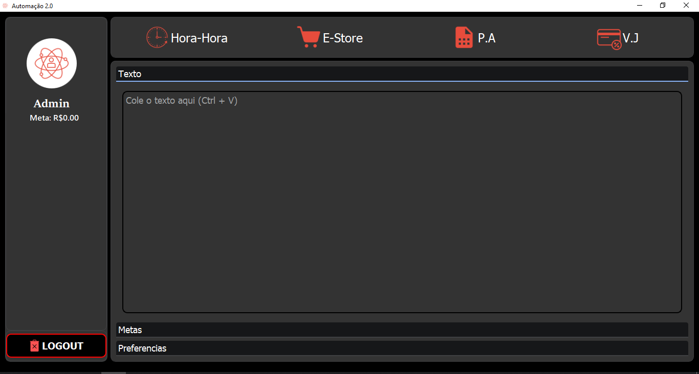
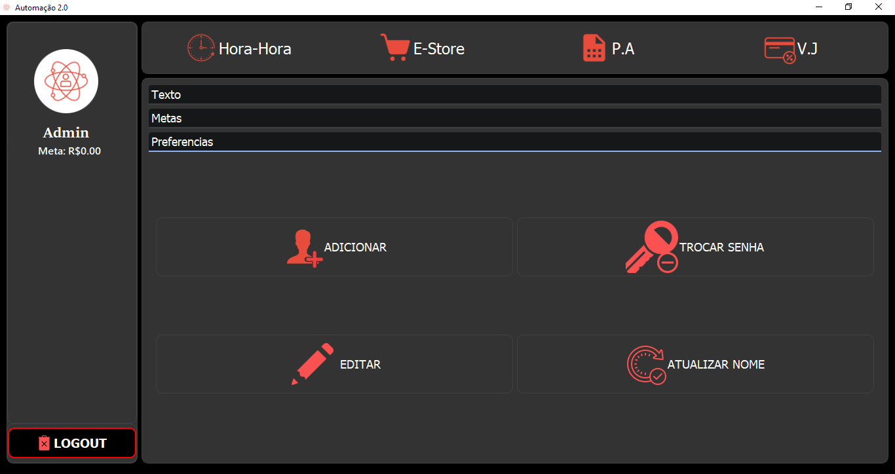

# Olá, Seja bem vindo a pagina do projeto automação!

> Serviços de automação de planilha, feito para RCHLO S.A  
Projeto Feito totalmente em Python3  
Front End: PyQt5.

## Login
### Para realizar o Login entre em contato com o suporte:
**📱 (43) 9 9661-7904**

## Automação - Como fazer?
### Para realizar o processo de automação, basta colar todo o texto do DWeb-RCHLO no campo indicado e selecionar a opção de planilha que deseja automatizar para o momento...

## Atualizar Metas
### Para atualizar as metas mensais basta atualizar o excel na pasta raiz, para isto você pode simplesmtnte clicar nestas opções abaixo e elas irão abrir a pasta raiz.
<image src = "img/pscreen3.png"/>

## Configurações
E aqui algumas das configurações de ADMIN...

 © Desenvolvido por Guilherme Barbosa André Breve - TecnoBreve 2022 © 

